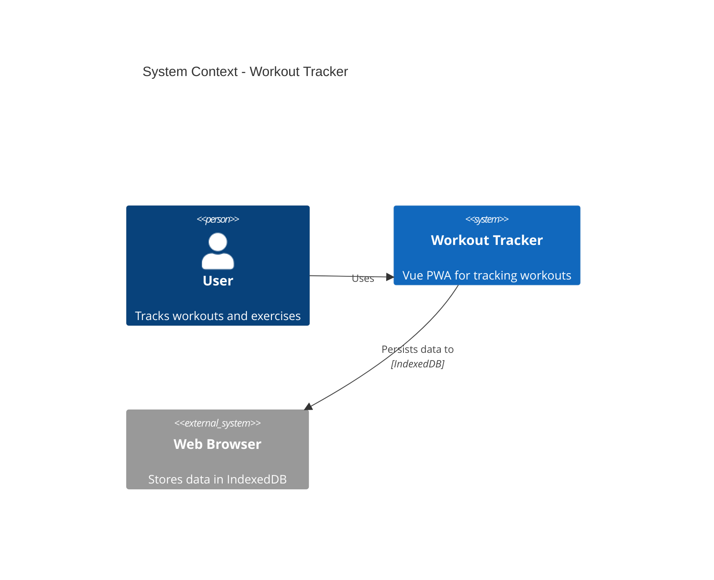
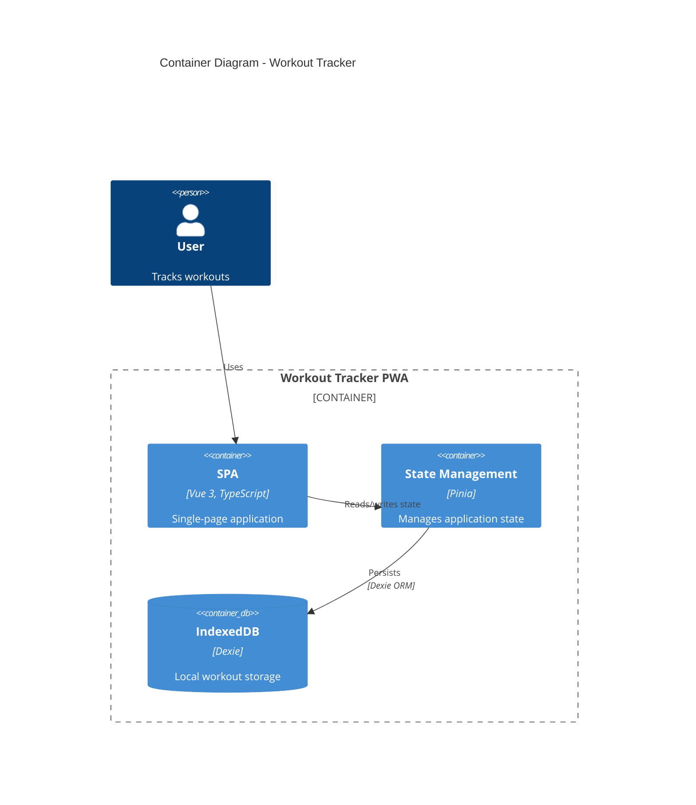
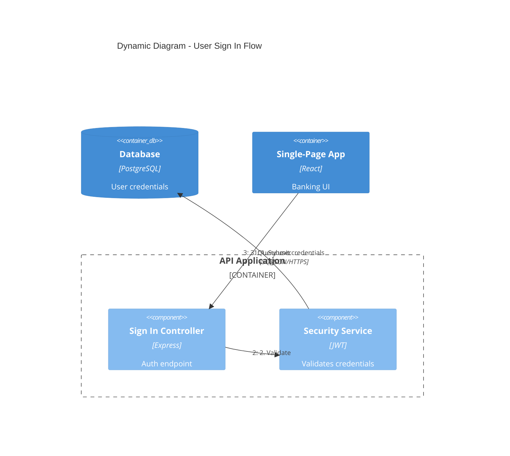
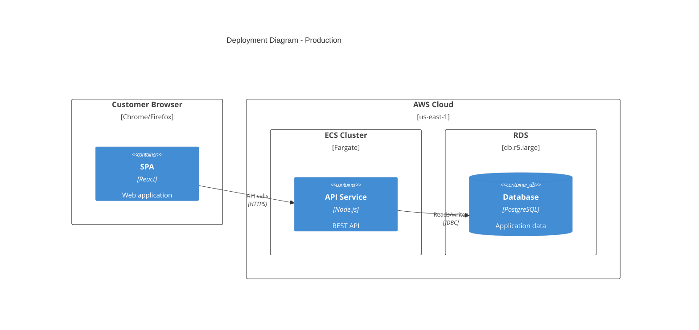
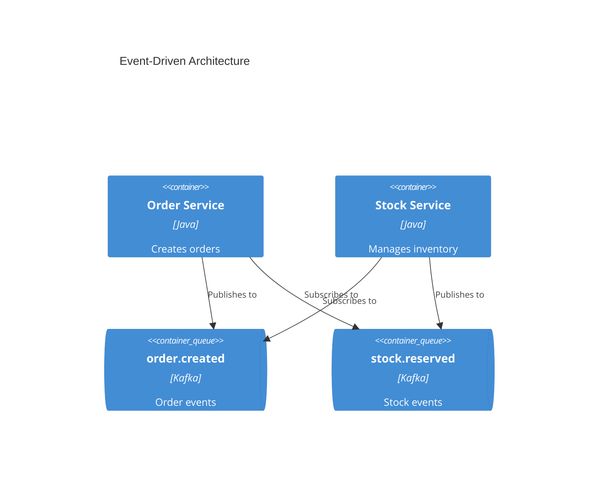

> 공통 원칙: core/PRINCIPLES.md 참조


# C4 아키텍처 문서화

C4 모델 다이어그램과 Mermaid 문법을 사용하여 소프트웨어 아키텍처 문서를 생성합니다.

## 워크플로우

1. **범위 파악** - 대상 독자를 기반으로 필요한 C4 레벨 결정
2. **코드베이스 분석** - 시스템 탐색하여 컴포넌트, 컨테이너, 관계 식별
3. **다이어그램 생성** - 적절한 추상화 수준의 Mermaid C4 다이어그램 작성
4. **문서화** - 설명 컨텍스트와 함께 마크다운 파일에 기록

## C4 다이어그램 레벨

| 레벨 | 다이어그램 유형 | 대상 | 표현 내용 | 생성 시점 |
|------|----------------|------|-----------|-----------|
| 1 | **C4Context** | 모든 사람 | 시스템 + 외부 액터 | 항상 (필수) |
| 2 | **C4Container** | 기술 담당자 | 앱, DB, 서비스 | 항상 (필수) |
| 3 | **C4Component** | 개발자 | 내부 컴포넌트 | 가치가 있을 때만 |
| 4 | **C4Deployment** | DevOps | 인프라 노드 | 프로덕션 시스템용 |
| - | **C4Dynamic** | 기술 담당자 | 요청 흐름 (순번) | 복잡한 워크플로우용 |

**핵심:** "Context + Container 다이어그램으로 대부분의 개발팀에 충분합니다." Component/Code 다이어그램은 진정으로 가치를 더할 때만 생성하세요.

## 빠른 시작 예시

### 시스템 컨텍스트 (레벨 1)


### 컨테이너 다이어그램 (레벨 2)


### 동적 다이어그램 (요청 흐름)


### 배포 다이어그램


## 요소 문법

### 사람과 시스템
```
Person(alias, "Label", "Description")
Person_Ext(alias, "Label", "Description")       # 외부 사람
System(alias, "Label", "Description")
System_Ext(alias, "Label", "Description")       # 외부 시스템
SystemDb(alias, "Label", "Description")         # 데이터베이스
SystemQueue(alias, "Label", "Description")      # 큐
```

### 컨테이너 / 컴포넌트
```
Container(alias, "Label", "Technology", "Description")
ContainerDb(alias, "Label", "Technology", "Description")
ContainerQueue(alias, "Label", "Technology", "Description")
Component(alias, "Label", "Technology", "Description")
```

### 경계 / 관계
```
Enterprise_Boundary(alias, "Label") { ... }
System_Boundary(alias, "Label") { ... }
Container_Boundary(alias, "Label") { ... }

Rel(from, to, "Label")
Rel(from, to, "Label", "Technology")
BiRel(from, to, "Label")          # 양방향
Rel_U/D/L/R(from, to, "Label")   # 방향 지정
```

## 모범 사례

1. **모든 요소에 포함:** 이름, 유형, 기술(해당 시), 설명
2. **단방향 화살표만 사용** - 양방향은 모호성 유발
3. **화살표에 동작 동사 레이블** - "이메일 발송", "~에서 읽기" (단순 "사용" 아님)
4. **기술 레이블 포함** - "JSON/HTTPS", "JDBC", "gRPC"
5. **다이어그램당 20개 이하 요소** - 복잡하면 분할

## 마이크로서비스 가이드라인

### 단일 팀 소유
각 마이크로서비스를 **컨테이너**로 모델링

### 다중 팀 소유
별도 팀 소유 시 **소프트웨어 시스템**으로 격상

### 이벤트 기반 아키텍처
개별 토픽/큐를 컨테이너로 표시 ("Kafka" 단일 박스 금지)



## 출력 위치

`docs/architecture/`에 저장:
- `c4-context.md` - 시스템 컨텍스트 다이어그램
- `c4-containers.md` - 컨테이너 다이어그램
- `c4-components-{feature}.md` - 기능별 컴포넌트
- `c4-deployment.md` - 배포 다이어그램
- `c4-dynamic-{flow}.md` - 특정 흐름 동적 다이어그램

## 대상별 적정 상세 수준

| 대상 | 권장 다이어그램 |
|------|----------------|
| 경영진 | 시스템 컨텍스트만 |
| 프로덕트 매니저 | 컨텍스트 + 컨테이너 |
| 아키텍트 | 컨텍스트 + 컨테이너 + 주요 컴포넌트 |
| 개발자 | 필요에 따라 전체 레벨 |
| DevOps | 컨테이너 + 배포 |

## 참고 자료

- [references/c4-syntax.md](references/c4-syntax.md) - 완전한 Mermaid C4 문법
- [references/common-mistakes.md](references/common-mistakes.md) - 피해야 할 안티패턴
- [references/advanced-patterns.md](references/advanced-patterns.md) - 마이크로서비스, 이벤트 기반, 배포 패턴
