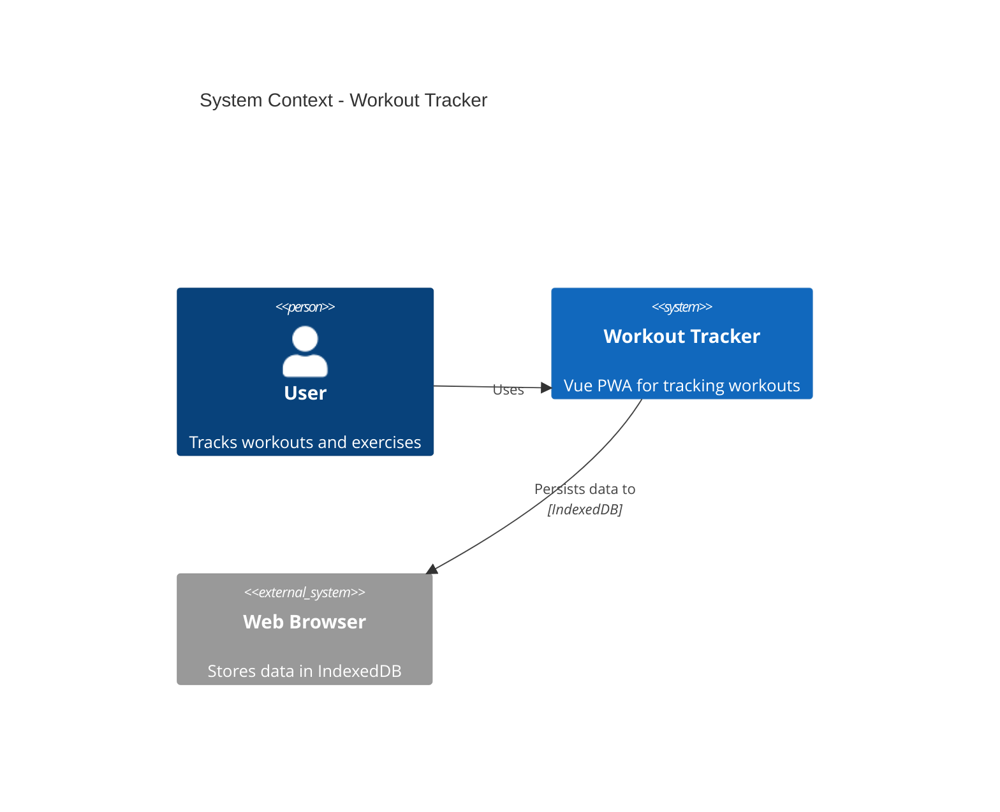
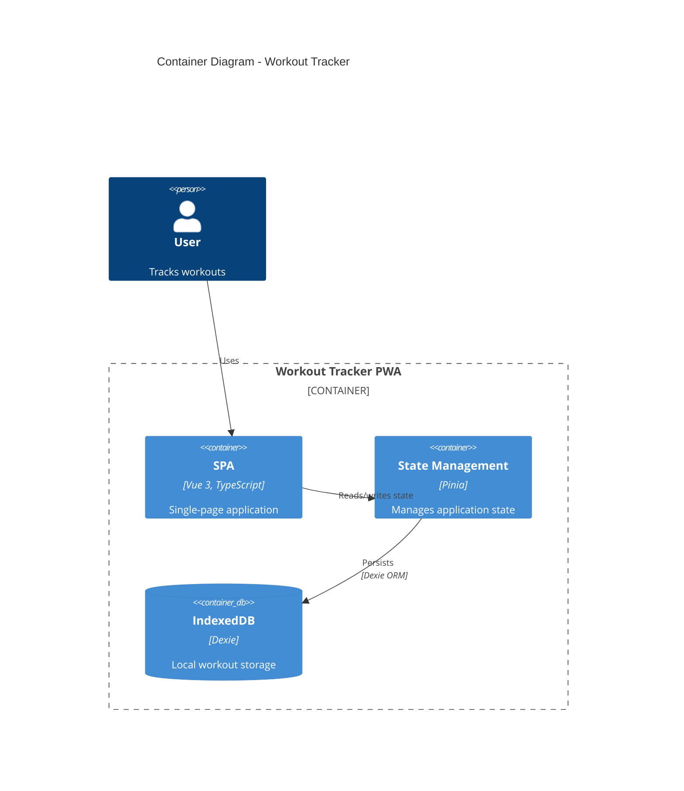
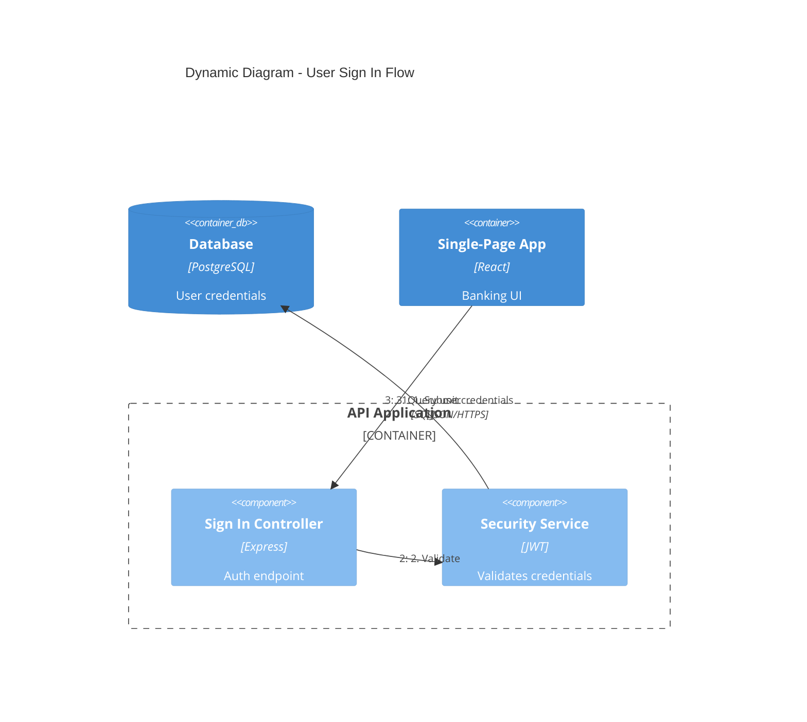
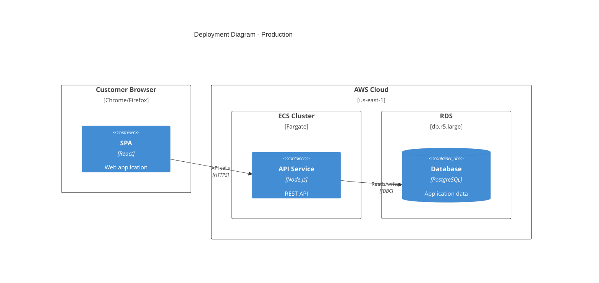
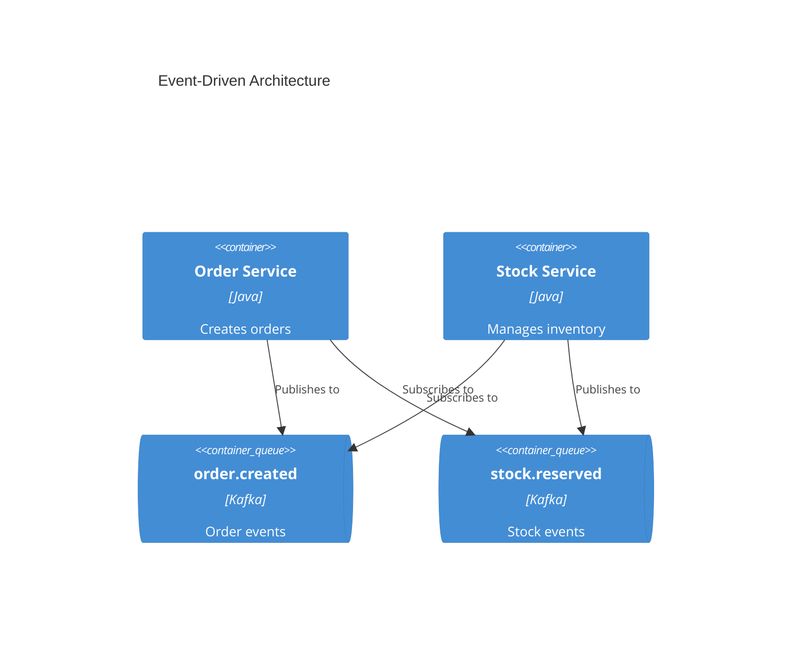

> Shared principles: see core/PRINCIPLES.md
> Core philosophy: see core/PHILOSOPHY.md


# C4 Architecture Documentation

Generates software architecture documentation using C4 model diagrams and Mermaid syntax.

## Workflow

1. **Determine scope** — Decide which C4 levels are needed based on the target audience
2. **Analyze the codebase** — Explore the system to identify components, containers, and relationships
3. **Generate diagrams** — Write Mermaid C4 diagrams at the appropriate level of abstraction
4. **Document** — Record in Markdown files with explanatory context

## C4 Diagram Levels

| Level | Diagram Type | Audience | Shows | When to Create |
|-------|-------------|----------|-------|----------------|
| 1 | **C4Context** | Everyone | System + external actors | Always (required) |
| 2 | **C4Container** | Technical stakeholders | Apps, DBs, services | Always (required) |
| 3 | **C4Component** | Developers | Internal components | Only when it adds value |
| 4 | **C4Deployment** | DevOps | Infrastructure nodes | For production systems |
| - | **C4Dynamic** | Technical stakeholders | Request flows (numbered) | For complex workflows |

**Key point:** "Context + Container diagrams are sufficient for most development teams." Only generate Component/Code diagrams when they truly add value.

## Quick Start Examples

### System Context (Level 1)


### Container Diagram (Level 2)


### Dynamic Diagram (Request Flow)


### Deployment Diagram


## Element Syntax

### People and Systems
```
Person(alias, "Label", "Description")
Person_Ext(alias, "Label", "Description")       # External person
System(alias, "Label", "Description")
System_Ext(alias, "Label", "Description")       # External system
SystemDb(alias, "Label", "Description")         # Database
SystemQueue(alias, "Label", "Description")      # Queue
```

### Containers / Components
```
Container(alias, "Label", "Technology", "Description")
ContainerDb(alias, "Label", "Technology", "Description")
ContainerQueue(alias, "Label", "Technology", "Description")
Component(alias, "Label", "Technology", "Description")
```

### Boundaries / Relationships
```
Enterprise_Boundary(alias, "Label") { ... }
System_Boundary(alias, "Label") { ... }
Container_Boundary(alias, "Label") { ... }

Rel(from, to, "Label")
Rel(from, to, "Label", "Technology")
BiRel(from, to, "Label")          # Bidirectional
Rel_U/D/L/R(from, to, "Label")   # Directional
```

## Best Practices

1. **Include for all elements:** name, type, technology (when applicable), description
2. **Use unidirectional arrows only** — bidirectional implies ambiguity
3. **Label arrows with action verbs** — "sends email", "reads from" (not just "uses")
4. **Include technology labels** — "JSON/HTTPS", "JDBC", "gRPC"
5. **No more than 20 elements per diagram** — split if too complex

## Microservices Guidelines

### Single team ownership
Model each microservice as a **Container**

### Multiple team ownership
Promote separately owned services to a **Software System**

### Event-driven architecture
Show individual topics/queues as containers (never a single "Kafka" box)



## Output Location

Save to `docs/architecture/`:
- `c4-context.md` — System context diagram
- `c4-containers.md` — Container diagram
- `c4-components-{feature}.md` — Components per feature
- `c4-deployment.md` — Deployment diagram
- `c4-dynamic-{flow}.md` — Dynamic diagram for specific flows

## Detail Level by Audience

| Audience | Recommended Diagrams |
|----------|---------------------|
| Executives | System context only |
| Product managers | Context + containers |
| Architects | Context + containers + key components |
| Developers | All levels as needed |
| DevOps | Containers + deployment |

## References

- [references/c4-syntax.md](references/c4-syntax.md) — Complete Mermaid C4 syntax
- [references/common-mistakes.md](references/common-mistakes.md) — Anti-patterns to avoid
- [references/advanced-patterns.md](references/advanced-patterns.md) — Microservices, event-driven, deployment patterns
