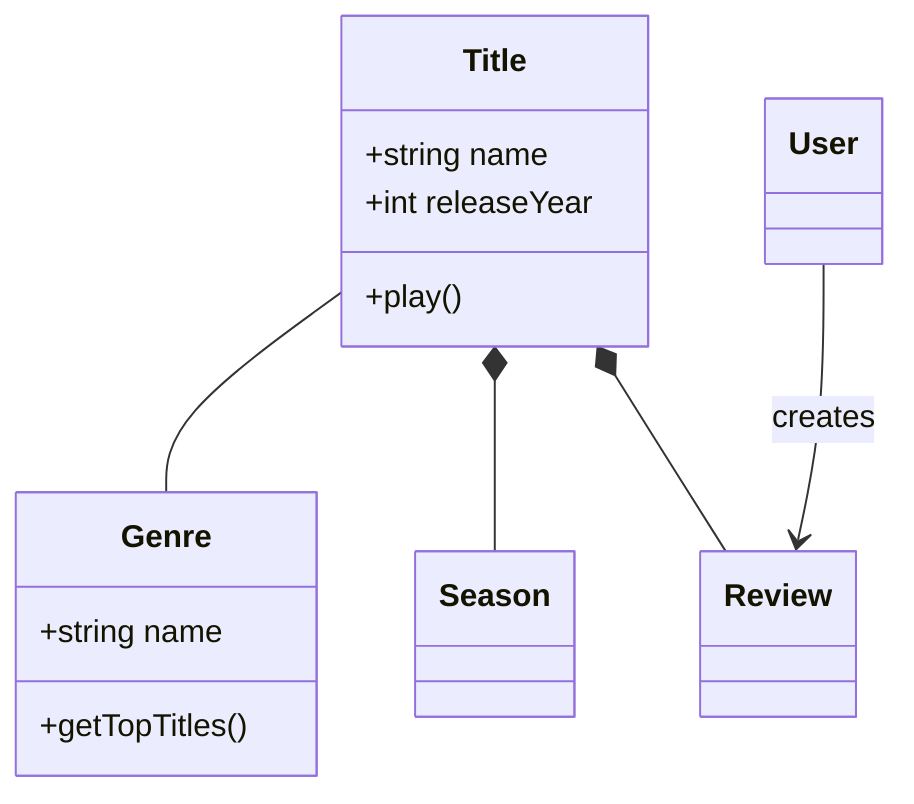
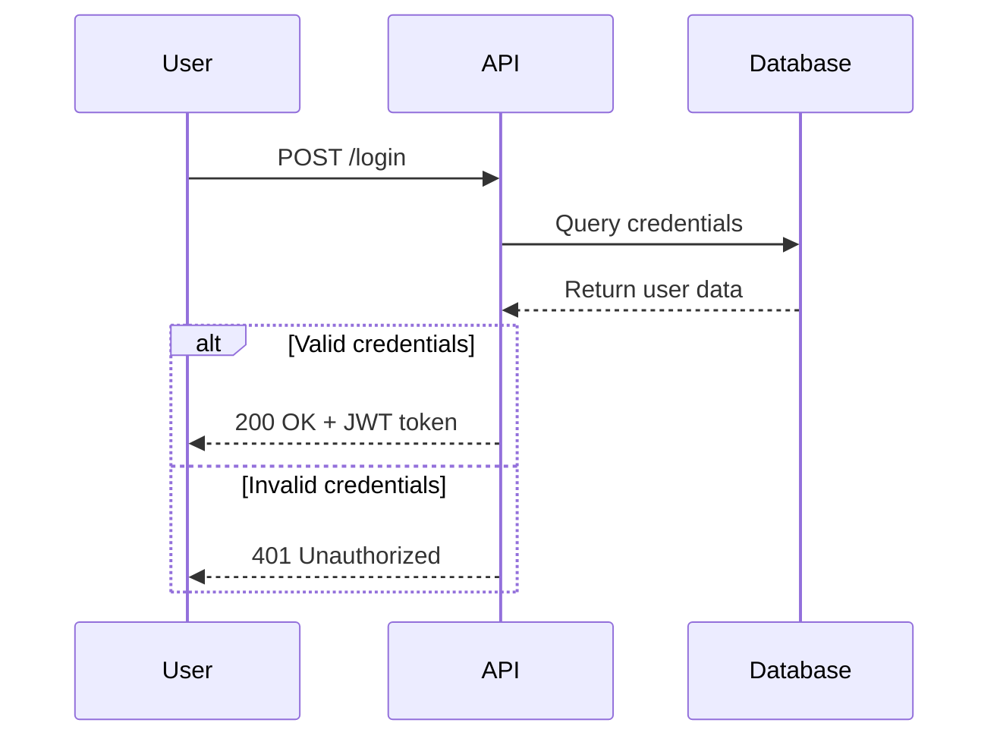
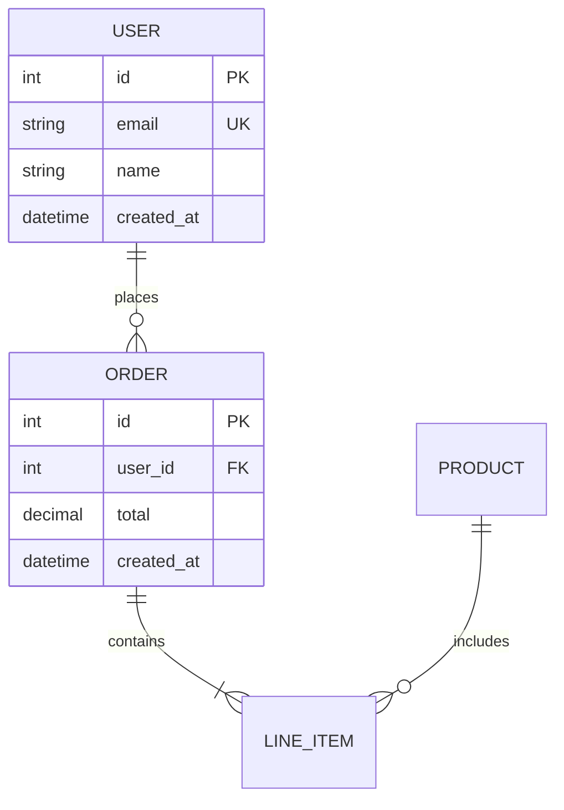
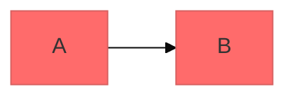

> 공통 원칙: core/PRINCIPLES.md 참조


# Mermaid 다이어그램 작성 가이드

Mermaid의 텍스트 기반 문법으로 전문적인 소프트웨어 다이어그램을 만드세요. Mermaid는 간단한 텍스트 정의로부터 다이어그램을 렌더링하므로, 버전 관리가 가능하고 코드와 함께 유지보수하기 쉽습니다.

## 핵심 문법 구조

모든 Mermaid 다이어그램은 다음 패턴을 따릅니다:

```mermaid
diagramType
  definition content
```

**핵심 원칙:**
- 첫 줄에서 다이어그램 타입 선언 (예: `classDiagram`, `sequenceDiagram`, `flowchart`)
- `%%`로 주석 작성
- 줄 바꿈과 들여쓰기는 가독성을 높이지만 필수 아님
- 인식되지 않는 키워드는 다이어그램을 깨뜨림; 잘못된 파라미터는 조용히 무시됨

## 다이어그램 타입 선택 가이드

1. **클래스 다이어그램** - 도메인 모델링, OOP 설계, 엔티티 관계
2. **시퀀스 다이어그램** - 시간 순서 상호작용, 메시지 흐름
3. **플로우차트** - 프로세스, 알고리즘, 의사결정 트리
4. **ERD** - 데이터베이스 스키마, 테이블 관계
5. **C4 다이어그램** - 여러 수준의 소프트웨어 아키텍처
6. **상태 다이어그램** - 상태 머신, 라이프사이클 상태
7. **Git 그래프** - 버전 관리 브랜치 전략
8. **간트 차트** - 프로젝트 타임라인, 일정 관리
9. **파이/막대 차트** - 데이터 시각화

## 빠른 시작 예제

### 클래스 다이어그램 (도메인 모델)


### 시퀀스 다이어그램 (API 흐름)


### 플로우차트 (사용자 여정)


### ERD (데이터베이스 스키마)


## 상세 참고 자료

- **[references/class-diagrams.md](references/class-diagrams.md)** - 도메인 모델링, 관계, 다중성, 메서드/속성
- **[references/sequence-diagrams.md](references/sequence-diagrams.md)** - 액터, 참여자, 메시지, 활성화, 루프, alt/opt/par 블록
- **[references/flowcharts.md](references/flowcharts.md)** - 노드 모양, 연결, 의사결정, 서브그래프, 스타일링
- **[references/erd-diagrams.md](references/erd-diagrams.md)** - 엔티티, 관계, 카디널리티, 키, 속성
- **[references/c4-diagrams.md](references/c4-diagrams.md)** - 시스템 컨텍스트, 컨테이너, 컴포넌트, 경계
- **[references/architecture-diagrams.md](references/architecture-diagrams.md)** - 클라우드 서비스, 인프라, CI/CD 배포
- **[references/advanced-features.md](references/advanced-features.md)** - 테마, 스타일링, 설정, 레이아웃

## 모범 사례

1. **단순하게 시작** - 핵심 엔티티부터, 점진적으로 세부 사항 추가
2. **의미 있는 이름** - 명확한 레이블로 자체 문서화
3. **주석 적극 활용** - `%%`로 복잡한 관계 설명
4. **집중도 유지** - 개념 하나당 다이어그램 하나; 큰 것은 여러 뷰로 분리
5. **버전 관리** - `.mmd` 파일을 코드와 함께 저장
6. **맥락 추가** - 제목과 노트로 다이어그램 목적 설명
7. **반복 개선** - 이해가 깊어질수록 다이어그램도 발전

## 설정 및 테마



**사용 가능한 테마:** default, forest, dark, neutral, base

**레이아웃:** `layout: dagre` (기본), `layout: elk` (복잡한 다이어그램용)

**외관:** `look: classic` (기본), `look: handDrawn` (스케치 느낌)

## 내보내기 및 렌더링

**기본 지원:** GitHub/GitLab, VS Code (Mermaid 확장), Notion, Obsidian, Confluence

**내보내기 옵션:**
- [Mermaid Live Editor](https://mermaid.live) - PNG/SVG 내보내기
- Mermaid CLI - `npm install -g @mermaid-js/mermaid-cli` → `mmdc -i input.mmd -o output.png`

## 흔한 실수

- **특수 문자 주의** - 주석에 `{}` 사용 금지, 적절한 이스케이프 사용
- **문법 오류** - 오타가 있으면 다이어그램 깨짐; Mermaid Live에서 검증
- **과도한 복잡성** - 복잡한 다이어그램은 여러 뷰로 분리
- **관계 누락** - 엔티티 간 중요한 연결을 빠짐없이 문서화

## 다이어그램을 그려야 할 때

**반드시 활용:** 새 프로젝트/기능 시작, 복잡한 시스템 문서화, 아키텍처 결정 설명, DB 스키마 설계, 리팩토링 계획, 온보딩
