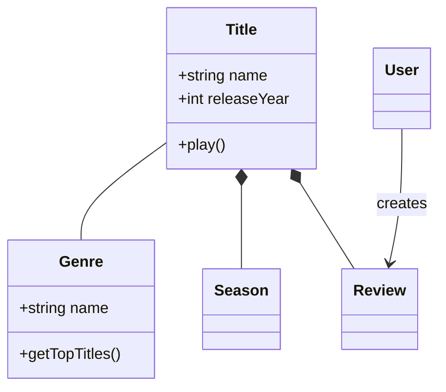
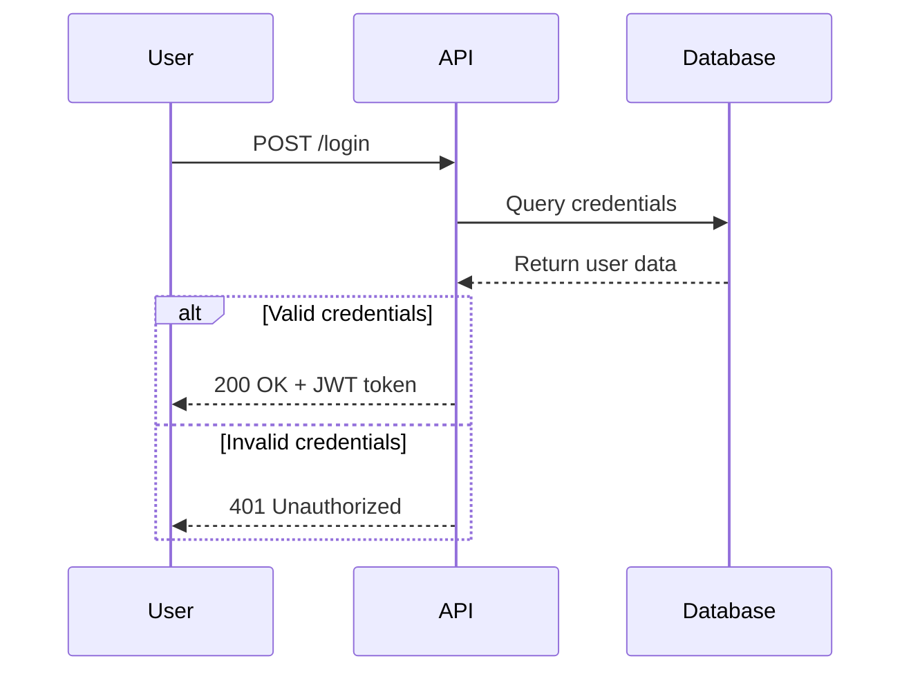
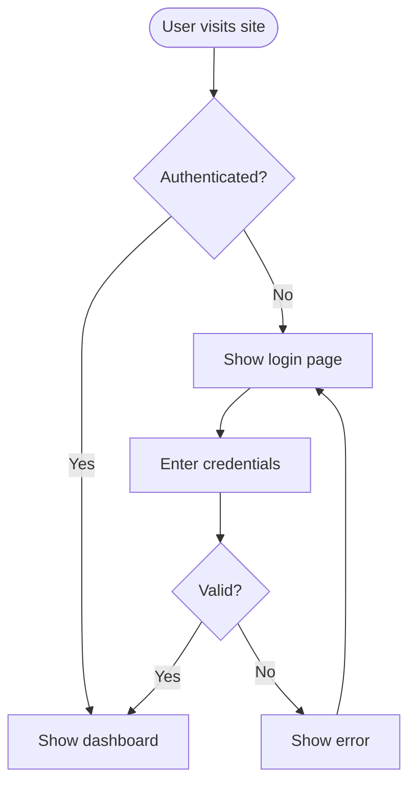
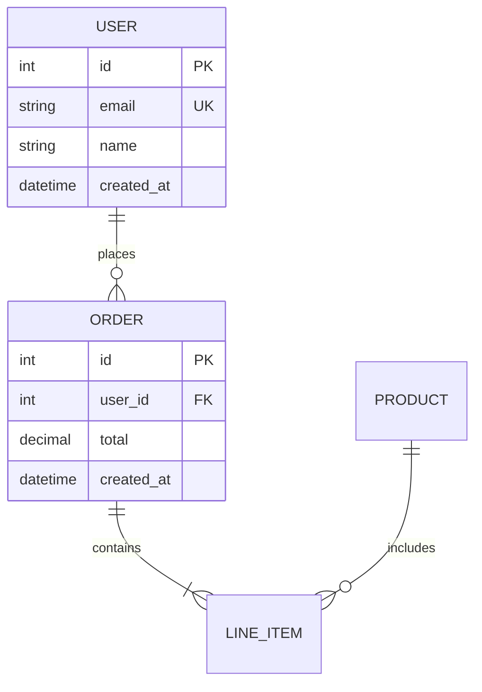
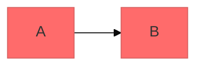

> Shared principles: see core/PRINCIPLES.md
> Core philosophy: see core/PHILOSOPHY.md


# Mermaid Diagram Writing Guide

Create professional software diagrams with Mermaid's text-based syntax. Mermaid renders diagrams from simple text definitions, making them version-controllable and easy to maintain alongside code.

## Core Syntax Structure

All Mermaid diagrams follow this pattern:

```mermaid
diagramType
  definition content
```

**Core principles:**
- Declare the diagram type on the first line (e.g., `classDiagram`, `sequenceDiagram`, `flowchart`)
- Write comments with `%%`
- Line breaks and indentation improve readability but are not required
- Unrecognized keywords break the diagram; invalid parameters are silently ignored

## Diagram Type Selection Guide

1. **Class Diagram** - Domain modeling, OOP design, entity relationships
2. **Sequence Diagram** - Chronological interactions, message flows
3. **Flowchart** - Processes, algorithms, decision trees
4. **ERD** - Database schemas, table relationships
5. **C4 Diagram** - Software architecture at multiple levels
6. **State Diagram** - State machines, lifecycle states
7. **Git Graph** - Version control branching strategies
8. **Gantt Chart** - Project timelines, schedule management
9. **Pie/Bar Chart** - Data visualization

## Quick Start Examples

### Class Diagram (Domain Model)


### Sequence Diagram (API Flow)


### Flowchart (User Journey)


### ERD (Database Schema)


## Detailed References

- **[references/class-diagrams.md](references/class-diagrams.md)** - Domain modeling, relationships, multiplicity, methods/attributes
- **[references/sequence-diagrams.md](references/sequence-diagrams.md)** - Actors, participants, messages, activations, loops, alt/opt/par blocks
- **[references/flowcharts.md](references/flowcharts.md)** - Node shapes, connections, decisions, subgraphs, styling
- **[references/erd-diagrams.md](references/erd-diagrams.md)** - Entities, relationships, cardinality, keys, attributes
- **[references/c4-diagrams.md](references/c4-diagrams.md)** - System context, containers, components, boundaries
- **[references/architecture-diagrams.md](references/architecture-diagrams.md)** - Cloud services, infrastructure, CI/CD deployment
- **[references/advanced-features.md](references/advanced-features.md)** - Themes, styling, configuration, layouts

## Best Practices

1. **Start simple** - Begin with core entities, add details incrementally
2. **Meaningful names** - Self-document with clear labels
3. **Use comments actively** - Explain complex relationships with `%%`
4. **Stay focused** - One diagram per concept; split large ones into multiple views
5. **Version control** - Store `.mmd` files alongside code
6. **Add context** - Explain diagram purpose with titles and notes
7. **Iterate** - Diagrams evolve as understanding deepens

## Configuration and Themes



**Available themes:** default, forest, dark, neutral, base

**Layout:** `layout: dagre` (default), `layout: elk` (for complex diagrams)

**Look:** `look: classic` (default), `look: handDrawn` (sketch style)

## Export and Rendering

**Native support:** GitHub/GitLab, VS Code (Mermaid extension), Notion, Obsidian, Confluence

**Export options:**
- [Mermaid Live Editor](https://mermaid.live) - Export as PNG/SVG
- Mermaid CLI - `npm install -g @mermaid-js/mermaid-cli` → `mmdc -i input.mmd -o output.png`

## Common Mistakes

- **Watch for special characters** - Do not use `{}` in labels; use proper escaping
- **Syntax errors** - Typos break diagrams; validate in Mermaid Live
- **Excessive complexity** - Split complex diagrams into multiple views
- **Missing relationships** - Document all important connections between entities

## When to Draw a Diagram

**Always use:** starting a new project/feature, documenting complex systems, explaining architecture decisions, designing DB schemas, planning refactoring, onboarding
